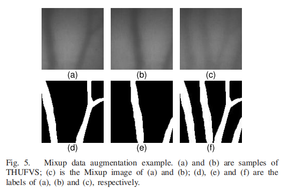

# EIFNet

an explicit and implicit feature fusion network for finger vein verification

用于手指静脉验证的**显式和隐式**特征融合网络

## abstract

从**二进制静脉掩膜**和**灰色原始图像**中提取的特征进行互补融合，提取更全面、更具区分度的特征

**FFM**：feature fusion module（特征融合模块 => MFEM && CFEM）

## introduction

EIFNet的4个模块：

1：MGM，mask generation module（掩码生成模块）

2：MFEM，mask feature extraction module（掩码特征提取模块）

3：CFEM，contextual feature extraction module（背景特征提取模块）

4：FFM，feature fusion module（特征融合模块）

【1】从原图中，提取静脉纹路

【2】【3】从掩码和原图中，分别提取特征

【4】融合上面的2个特征

## related work

指静脉识别系统：

1：数据获取

2：图像预处理

3：特征提取

4：特征匹配

## methodology

显式特征 ==> 二值化掩码

隐式特征 ==> 灰度原图

### mask generation

> MGM的组成：U-Net + CBAM

CBAM：convolutional block attention module

> MGM的损失函数：

L-CE：交叉熵损失

L-Dice：dice损失

[图像分割 | Dice损失函数以及评估指标_dice coefficient-CSDN博客](https://blog.csdn.net/qq_45023353/article/details/130507773)

L-p：惩罚项损失（带权重，λ = 0.05）

s-i：预测为掩码的像素

y-i：ground truth中为掩码的像素

### feature extraction and fusion

> 融合的目的

1：隐式特征有冗余的背景信息

2：掩码不完整，缺乏特征

> 3个特征融合节点

原因：浅层特征=>纹理信息，深层特征=>语义信息

F1、F2、F3（桥梁）

FF Block1、FF Block2（融合）

> 门控层

作用：控制不同特征对于融合特征的影响

权衡操作 ==> 找最优参数

> 损失函数

L-con：contrastive loss，对比损失

​	样本对 => (xi, xj)

​	xi和xj是同一类别时，y = 1

​	xi和xj是不同类别时，y = 0

​	xi特征和xj特征之间的欧氏距离

​	

损失函数计算公式：

d_b：b类标签的样本对之间的距离

B：每个训练批次中的总样本对数量

α：样本x的特征半径（α = 2）

**只有特征距离小于α的不同类别样本对（y=0），才会被纳入损失函数计算**

### dataset

> mixup操作（数据增强）

a和b混合 => c

d和e混合 => f

> 其他数据增强

structure, contrast and brightness.

结构、对比度、亮度

## experiments and results

### implementation details

> 训练过程

1：单独训练MGM

2：固定MGM的参数，训练EIFNet

> 评价指标

EER

[什么是Equal Error Rate （EER）-CSDN博客](https://blog.csdn.net/hanlin_tan/article/details/39183843)

### evaluation of the mask generation module

1：MGM和其他分割方法对比

2：MGM自身的迭代次数对比（epoch = 20）

3：MGM增加注意力前后的对比（CBAM）

4：输入是否采用数据增强的对比（mixup）

### ablation

1：FFM（特征融合）的有效性

2：batch size

等等（具体查论文的表格）

