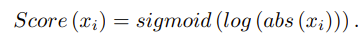

# FESNet

study of 3D finger vein biometrics on imaging device design and multi-view verification

## 摘要

1：multi-view finger vein dataset

2：Multi-view Finger Vein Feature Encoding and Selection Network

多视角指静脉特征编码和选择网络，MFV-FES Net

**改进的transformer编码器**，可学习不同视角之间的依赖性

提取的全局特征 & 局部主导特征 ===（融合）===> 高辨别度的特征描述符

## 引言

> 指静脉识别的优点

1：活体识别

2：高稳定性

3：高安全性

> 贡献

1：低成本全视角指静脉图像采集设备

2：8个视角的数据集

3：MFV-FESNet。通过融合全局&局部特征，生成高区分度的描述符

4：超过一些3D物体识别算法的sota

## 采集设备

> 4个组成模块

1：相机

2：照明

3：控制

4：支撑

## 多视角指静脉验证

### 模型结构

feature encoding and selection

> 浅层部分

1：FCN（全卷积网络），提取raw descriptors

2：CNN，生成view descriptors

FCN包含ResNet-18的前5个卷积层，CNN包含剩下的层

每个视角（view）的指静脉图像，均通过FCN + CNN，获得2类descriptor（view和raw）

> 深层部分

2类descriptor（view和raw），喂到下面的网络，最后融合成final descriptor

1：CFET（context feature encoding transformer，上下文特征编码），提取全局上下文特征

2：DFSM（dominant feature selection module，主导特征选择），提取局部主导特征

### context feature encoding transformer（全局）

view descriptor组成**V**，由**N个1xD_0维度**的向量组成

（1）利用**矩阵乘法**，把V投影到D维，初始化一个可学习的全局token为**v_class**，维度是**1xD**

（2）位置编码**E_pos**，维度是**(N+1)xD**

> transformer编码器的操作

1：层归一化，LN

2：多头自注意力，MSA

3：多层感知，MLP

4：残差链接

> LN和MSA的作用

层归一化预处理Z_0，得到Z_0_*

多头自注意力联合提取Z_0_*中不同表征子空间的信息，并结合Z_0得到Z_1

> MLP的作用

层归一化预处理Z1，然后由多层感知机处理，旨在提高模型的泛化能力

MLP层 = 2个线性层 + GELU

> 获得global context descriptor

下面z_class（全局class）和z_1...z_N（各视角信息），都是来自Z_1_*

通过全局池化，得到最终的全局descriptor

### dominant feature selection module（局部）

DFSM的作用：筛选2个代表视角，解耦一组多视角图像的主要特征

> DFSM的结构

1：raw descriptors通过FCN和全连接层，获取初始值X

2：计算每个视角的dominance scores

3：选择score最高的2个视角

> It is noted that CNNs are shared between different views in the same module, but not between different modules.

CNN的参数共享问题（？）：

在同一模块中的不同视角之间，行

在不同模块之间，不行

## 实验和结果

### 配置

训练集 : 测试集 = 3 : 2

初始学习率：5e-5

优化器：adam

### 多视角研究

视角越多，EER越低，效果越好

### 不同池化层的影响

对比max pooling和average pooling

平均池化更好

原因：平均池化保留总体特征，最大池化保留主导特征

### 消融实验

CEFT和DFSM

### 对比sota

基于视角的3D物体识别

