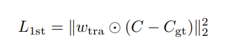
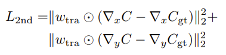

# NeRF静脉重建

Improving 3D Finger Traits Recognition via Generalizable Neural Rendering

通过通用神经渲染改进 3D 手指特征识别

**FingerNeRF**

## 摘要

> 显式3D方法的步骤：

1：显式重建3D模型

2：从3D模型，提取特征

> 显式3D方法的问题：

1：重建过程中，信息缺漏

2：特定硬件和三维重建算法之间的耦合

> 引入额外的几何先验性

1：TGT，trait guided transformer

（在手指特征的指导下增强特征对应性）

2：Depth Distillation Loss && Trait Guided Rendering Loss

（体积渲染损失的额外几何限制）

## 引言

> 3D finger biometrics的优点
>
> ——handle the recognition problem of 3D finger biometrics

1：comprehensive

2：robust

3：anti-counterfeiting

> Finger-NeRF的目标

1：通用于未见过的3D手指识别

2：处理输入的稀疏视点图像

> MVS，multi-view stereo

Since the cost volume is constructed by warping the 2D image features of nearby views (infered by CNNs) on sweeping depth planes in the reference view’s frustum, the matching relationship on epipolar lines is inherently modeled via homography function.

利用cost volume，推断深度图

> MVSNeRF

利用cost volume，通过neural encoding volume对每个场景的几何和外观进行编码

> shape-radiance ambiguity的原因

1：与自然图像相比，手指生物识别图像的纹理并不丰富

2：仅基于多视角图像的可微分神经渲染，缺乏对三维形状几何属性的广泛约束

> 规范NeRF表征训练的步骤

1：TGT

手指特征的自注意力 ==> 加强跨视角的特征图 ==> 引导构建cost volume

2：Depth Distillation Loss and Trait Guided Rendering Loss.

DD-Loss：在单目深度估算中，将大型模型估算的粗几何先验值提炼到渲染的深度图中，而不考虑比例差异

TG-Loss：利用手指特征线索对神经渲染光度损失进行正则化，隐式地正则化光线上不同视图的手指特征对应关系

> 贡献

1：基于 NeRF 的隐式表示。通过可变渲染对 3D 信息进行隐式建模

2：FingerNeRF。（1）根据生物识别中的开放集设置，对未知对象进行归纳。（2）只要求稀疏的视点输入，默认为3。（3）纠正形状-辐射模糊性，呈现合理的深度图

3：解决形状-辐射模糊性。TGT + （DD-Loss && TG-Loss）

4：数据集

## 相关工作

【1】3D verification on finger biometrics

【2】neural rendering

## 方法

> Finger-NeRF框架图

> NeRF渲染像素值的公式

沿射线的光线衰减和颜色累积过程

> 训练损失

光度量损失：渲染像素颜色和真实像素颜色的平方误差，求和

R(P) 表示从特定目标相机姿态 P 观测到的2D图像中的所有射线

> MVS NeRF

cost volume：计算不同视图之间的方差，堆叠一系列深度平面z的变换特征图

通过 U-Net B，生成神经编码体积 S

> 通用化NeRF的架构：encoder - decoder

1：encoder：3D重建网络。成本体积的中间隐式表示，作为输出保留，而不是估计深度图

2：decoder：NeRF网络。基于采样3D点处通过三线性插值获得的成本体积特征

### TGT

作用：引入手指特征的额外先验对应关系，到代价体积中。

> feature extraction

利用2个CNN，提取2D特征图

第1个CNN，提取H * W * 3的原图

第2个CNN，提取H * W * 1的二值化图

最后2D特征图的大小为 H * W * C1

> feature volume construction

利用指纹特征体积（下面的Gi）来引导成本体积的构建
$$
\hat{G}_i
$$

> epipolar Self-attention

基于**缩放点积**的注意力机制

Q 是查询矩阵（Query），表示当前视图中的特征。

K 是键矩阵（Key），表示在参考视图中的特征。

V 是值矩阵（Value），表示在参考视图中与键关联的特征值。

在同一视图中提取信息，Q,K,V 都等于对极线特征矩阵Gi：
$$
Hi(u,v)=Att(Gi(u,v),Gi(u,v),Gi(u,v))
$$
trait feature的计算：
$$
\hat{H}_i(u,v)=Att(\hat{G}_i(u,v),\hat{G}_i(u,v),\hat{G}_i(u,v))
$$
对极线特征矩阵的维度：D * C1

> epipolar cross-attention

不同视图之间的对极线上的交叉注意力：

利用trait feature作为指导来改进的交叉注意力：

> cost volume construction

通过计算参考视图和源视图中特征的方差，来构建成本体积

> radiance field construction

给定任意3D位置 x 和观察方向 d，可以计算体积密度和颜色：

c-img：所有视角的**原图**的像素颜色的拼接

c-tra：所有视角的**二值化图像**的像素强度的拼接

### extra geometric priors

> end-to-end training

光度损失仅直接约束预测的颜色c-out

没有直接与体积密度 σ 关联，只是基于颜色一致性假设对 σ 的间接粗略正则化

> depth distillation loss

没有可用的真实深度：利用大型单目深度估计模型（Midas）生成的伪深度图

尽管没有绝对深度用于深度监督，**局部区域深度的相对变化**仍然可以在3D形状上提供有效的正则化

（局部深度变化建模——基于窗口的采样方法）

最小二乘法，求解θ

> trait guided rendering loss

在采样窗口中的二值特征强度 Ctra 首先通过 softmax 函数进行平滑处理

计算一阶渲染损失L_1st

计算二阶渲染损失L_2nd

C_gt is the ground truth pixel color in target image.

最终的**特征引导渲染损失**：

> overall loss

## 实验

> 问题

Q1：隐式方法与现有的显式3D重建流程相比

Q2：在可泛化的神经渲染设置下，与其他基于NeRF的方法相比

Q3：基于稀疏视角的多视图方法，改进？

Q4：泛化到不同的指纹特征模态

> 评价指标

verification：

1：DET曲线

2：EER曲线

3：TAR@FAR=0.01

4：TAR@FAR=0.001

identification：

1：mAP

2：Rank-1 Accuracy（累积匹配特征曲线）

3：Rank-5 Accuracy（累积匹配特征曲线）

