# 基于扩散模型与神经衰减场的指静脉图像身份识别研究

diffusion model

neural attenuation field

## 摘要

> 基于扩散模型，DiffVein

子任务：纹路分割 + 类别预测

双向数据通路机制

分割网络 ==特征&语义==> 降噪网络

分割网络 <==空间注意力== 降噪网络

基于傅立叶空间结构相似性的降噪网络训练损失函数

> 基于神经衰减场

建模 ==> 射线穿过不同人体介质时的衰减过程

穿透成像

> 基于多头注意力，RayFormer

衰减因子预测网络

## 绪论

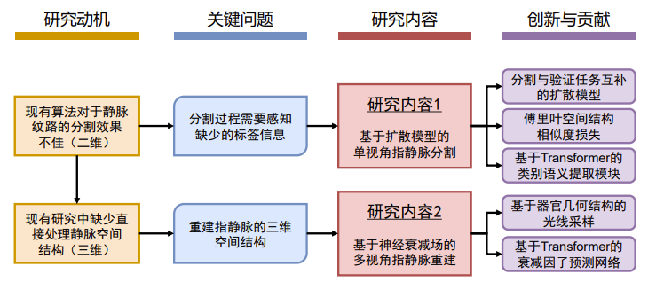

> 1：单视角分割

分割&识别，融合为一个互补的多任务学习过程  ==> Transformer

优化降噪网络的学习过程 ==> 傅里叶空间结构相似度损失函数

> 2：多视角重建

表征静脉的隐式空间结构（多种介质构成的离散空间） ==> 神经网络衰减场

预测离散空间各处的衰减因子  ==> Transformer

优化模型从稀疏视角图像学习空间信息的能力 ==> 基于器官几何结构的光线采样策略

## 单视角

### 指静脉掩膜分割方法

#### 网络结构

1：基于卷积核

改变卷积核的形态，获得不同的感受野

eg，扩张卷积，可变形卷积

2：基于架构

学习特殊的器官几何和拓扑特征

eg，形态先验知识，点集表示法

#### 特征融合

整合额外的特征（全局&局部，多尺度特征融合）

#### 损失函数

中心线Dice的相似性度量（clDice）

深度距离变化（DDT）

### 扩散概率模型

分类和回归问题：【1】判别、【2】生成

> 扩散模型的过程

1：前向过程

向输入图像x0，不断加入噪声，经过T个时间步长后，x0转化为纯噪声图像xT

（马尔可夫过程）

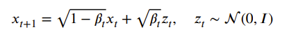

2：反向过程

预测降噪操作，经过T个噪声后，把xT还原为x0

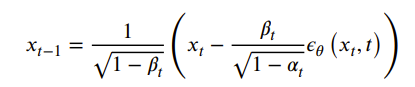

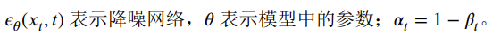

> 扩散模型的训练目标

最小化原始数据和反向生成数据之间的差异

（平方差）

在较低维度的类别标签向量下进行条件生成建模

### 【方法】

#### DiffVein总体框架

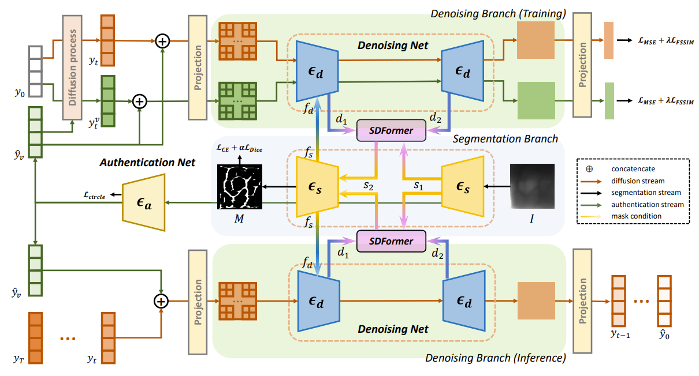

上半部分：训练

下半部分：推理

颜色越深，噪声越多

> 组成模块

1：分割分支（紫色）

2：身份验证网络

3：降噪分支（绿色）

两个分支的主体是U-Net变种

#### 静脉分割与身份验证网络

分割网络的结构：

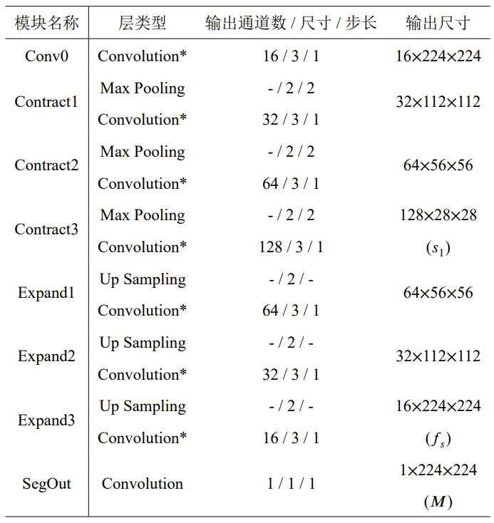

> 身份验证任务

1：验证（匹配训练集和验证集）

2：识别（预测类别，类别大小为数据集总数N）

#### 扩散过程与降噪网络

分割网络的掩膜特征嵌入与噪声嵌入相结合

掩膜条件引导策略

#### 傅里叶空间结构相似度损失

SSIM：结构相似度指数，structural similarity index

**SSIM损失函数**的学习目标：最大化预测图像与目标图像之间的结构相似度

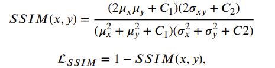

欧式空间 ==> 傅里叶空间：幅值 + 相位

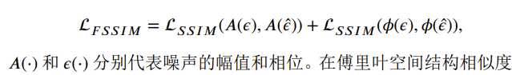

降噪网络的损失：MSE损失 + 傅里叶空间相似度损失

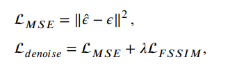

#### 傅里叶空间注意力与语义差分模块

语义差分模块：SD-Former，Semantic Difference Transformer

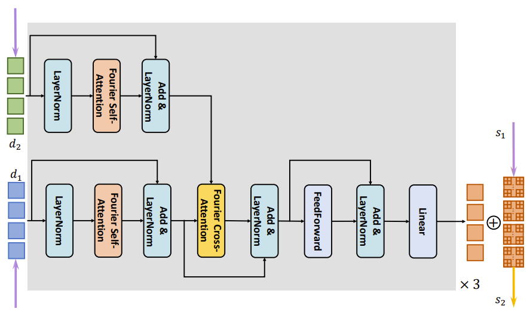

> **扩散嵌入**与**分割网络**的特征图之间存在域的差异 ==> 注意力机制

1：FSA，傅里叶空间自注意力

分离特征嵌入中，不同频谱的语义与噪声

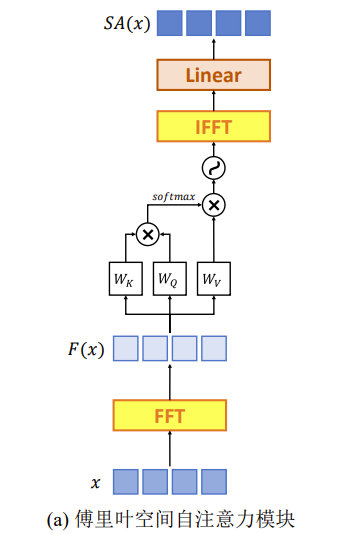

2：FCA，交叉注意力

在频域中，对两个特征嵌入的相似频率特征，进行语义重组

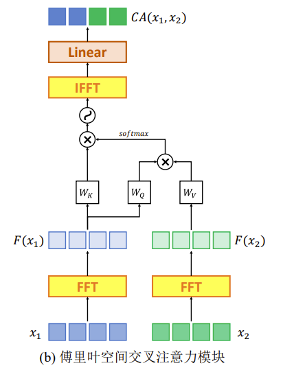

### 【实验】

> 识别，identification

一对多匹配，分类

Accuracy

> 验证，verification

一对一匹配

FAR（False Accept Rate）

FRR（False Reject Rate）

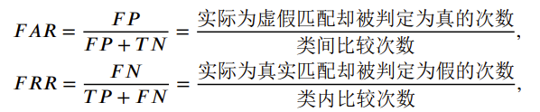

## 多视角

### NeRF

隐式表征方法，通过定义一个空间中变化的函数，间接描述三维形状

> 核心：连续体积密度 + 方向辐射亮度

1：体积密度。体积密度越高，不透明度越高。

2：辐射亮度。从特定视角观察，光线在空间某点的颜色和亮度。

> 实现：全连接网络

空间位置 + 观察视角 ==> 颜色 + 体积密度

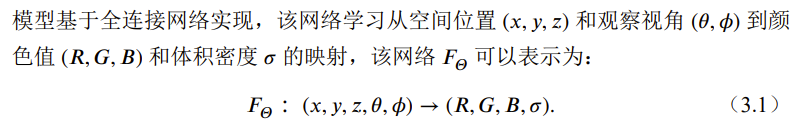

合成新视角图像 ==> 基于体积的渲染算法

沿着视线积分体积密度和辐射亮度

> 连续

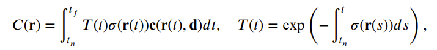

T(t)是从视线起点到t位置的透光率

> 离散

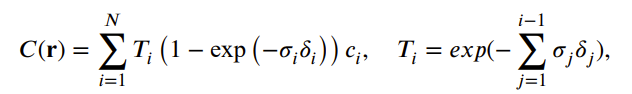

### 【方法】

#### 衰减合成与目标函数

穿透式成像，不适合基于颜色&&体积密度的辐射场预测

==> 基于Lambert-Beer定律的衰减场模型（描述光通过介质时，强度的指数衰减现象）

> 光线强度

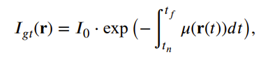

离散化后：

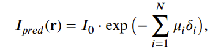

训练目标：最小化 预测光强 和 真实光强 的总平方误差

> 本文的神经衰减场模型的组成

1：射线采样

2：位置编码器

3：衰减系数预测网络

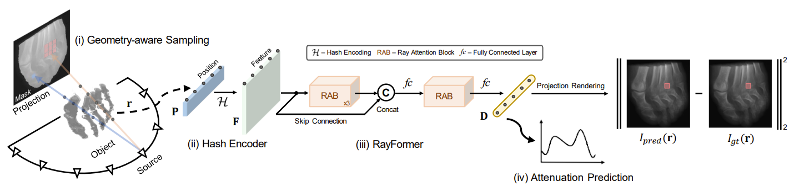

#### 基于几何的光线采样策略

GAS：geometry-aware sampling

> 策略

1：通过分割/二值化，提取前景

2：分割image为S * S的非重叠图像块，图像块集合为W

3：从W中随机抽取Ns个图像块，组成有序队列Ws

4：在Ws内采样，集合为Rs

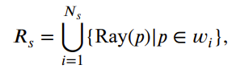

Ray(p)：将图像块wi中的每个像素p，映射到采样射线

#### 基于哈希编码器的位置嵌入

位置编码器 ==> 映射采样点的三维空间坐标，到更高维的空间

hash encoder ==> 在低维捕获足够的空间信息，降低计算量

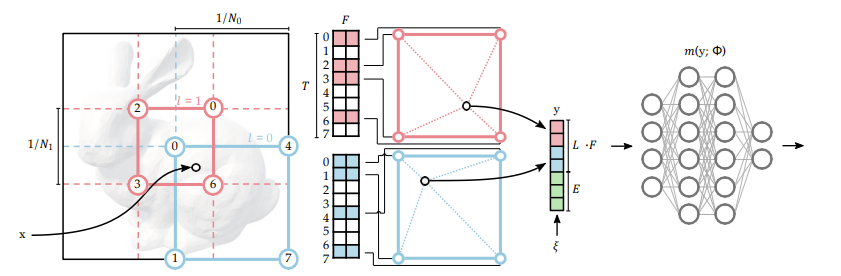

#### 衰减因子预测网络（Ray-Former）

> Ray-Former由4个光线自注意力模块构成
>
> 每个模块包含1个MHSA和1个FFN

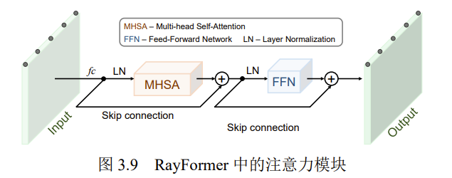

> MHSA

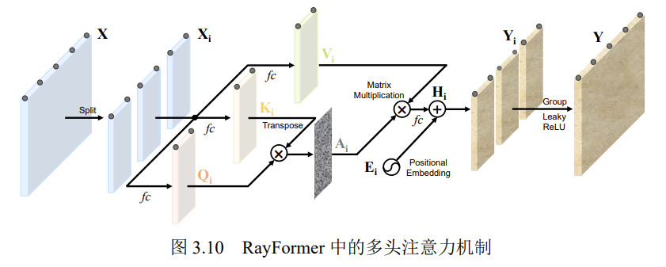

### 【实验】

断层图像合成任务：利用一系列环绕视角的放射线图像，生成被扫描对象在不同断面沿扫描旋转轴的二维图像

## 总结

### 单视角（扩散模型）

1：分割分支和降噪分支的**双向数据通路**，前向通路分割

2：**语义差分模块**，提取降噪网络中的类别语义差异性

3：降噪网络，引入**傅里叶空间结构相似度损失**

### 多视角（神经衰减场）

1：**神经衰减场**，穿透式成像建模（区别于可见光的神经辐射场建模）

2：基于几何结构的光线采样策略，**稀疏**视角

3：基于**多头注意力**的衰减因子预测模块