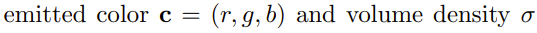

# NeRF

representing scenes as neural radiance fields for view synthesis

https://blog.csdn.net/KANG157/article/details/131010242

## 摘要

输入：空间位置（3维）+ 视角方向（2维）

输出：体积密度 + RGB颜色

## 引言

贡献：

1：5D神经辐射场，利用MLP网络参数化。

2：基于体积的可微分渲染。分层采样策略，分配MLP容量到可见场景的空间。

3：位置编码，将5D映射到高维空间，表征high-frequency场景。

## 相关工作

1：neural 3D shape representations

2：view synthesis and image-based rendering

## NeRF场景表征

> Neural Radiance Field Scene Representation

**输入**：3D坐标 + 2D视角方向（将方向表示为一个3D笛卡尔单位向量 **d**）

**输出**：3D颜色 + 1D体积密度

**MLP网络**：优化MLP的权重 **Θ**，得到更好的映射

映射流程：

==> 输入为坐标位置 **x**，通过8个全连接层（激活函数使用ReLU，每层256个通道）

==> 输出为体积密度 **σ** 和256维的特征向量 vector

==> 特征向量 vector 和视角方向 **d** 进行concat，通过1个全连接层（激活函数使用ReLU，每层128个通道）

==> 输出为RGB颜色 **c**

**映射约束**：

1：体积密度 **σ**，只通过坐标位置 **x** 映射

2：RGB颜色 **c**，通过坐标位置 **x** 和视角方向 **d** 映射

## 体积渲染

> Volume Rendering with Radiance Fields

在射线上的期望颜色：

 T(t)是累积透射率

数值积分，来估算连续积分。使用**分层采样**方法，将 [tn, tf] 划分为 N 个等间隔的区间，并在每个区间内随机均匀地采样一个点

分层采样能够表示连续的场景，因为在优化过程中，MLP能够在连续的位置上进行评估

离散化计算颜色：

==> 相邻采样点之间的距离

移除视角依赖 ==> 模型无法重现镜面反射

移除位置编码 ==> 降低模型表示高频几何和纹理的能力（过平滑）

## 优化NeRF

> optimizing a neural radiance field

2个改进 ==> 高分辨率复杂场景的表示：

1：输入坐标的位置编码 ==> 帮助MLP表示高频函数

2：分层采样 ==> 采样高频表示

### 位置编码（positional encoding）

把映射函数修改为**复合函数**：

γ：映射到高维，R到R^{2L}

新的F_Θ：普通MLP

编码函数 γ(p) 的公式：

编码函数应用于归一化后的位置坐标 **x **（范围是[-1, 1]）和归一化后的笛卡尔视角方向 **d** （范围是[-1, 1]）

对于x：L=10

对于d：L=4

### 分层体积采样（hierarchical volume sampling）

根据对最终渲染的预期影响，分配样本

同时优化2个网络，coarse + fine

【1】coarse网络的计算

==> 采集**Nc**个坐标位置

==> 调用“把射线均分成N个子区间，每个子区间内随机采样1个位置”的方法

==> 通过离散积分进行颜色计算

【2】fine网络的计算

==> 获得coarse网络的输出

==> 重写离散积分的颜色计算，变成沿射线所有采样颜色 **c_i** 的加权和

==> 权重归一化，在射线上生成一个分段常数的概率密度函数

==> 使用逆变换采样，从该分布中采集**Nf**个坐标位置

==> 在**Nc ∪ Nf**个样本上，通过离散积分进行颜色计算

方法与**重要性采样**类似，但是将采样值用作整个积分域的**非均匀离散化**，而不是将每个样本视为对整个积分的**独立概率估计**

### 实现细节

为每个场景优化了一个独立的神经连续体积表示网络，需要的内容：

1：该场景下的一组RGB图像数据集

2：相机姿态和内参

3：场景边界

合成数据 ==> ground-truth相机姿态 + 内参 + 边界

真实数据 ==> 使用**COLMAP** structure-from-motion package包，预测真实数据的参数

> 每次优化迭代过程

==> 从数据集中所有像素的射线集合，随机采样一批相机射线

==> 分层采样，在coarse网络查询Nc个样本，在fine网络查询Nc + Nf个样本

==> 通过体积渲染的离散积分方法，渲染每个射线下的颜色，coarse渲染1个初始颜色，fine渲染1个最终颜色

> 损失：total squared error

总平方误差之和 ==> coarse颜色的误差 & fine颜色的误差

R 是每批中的射线集合

最小化coarse颜色的误差的原因：coarse网络的权重分布，用于在fine网络中分配样本

> 具体参数设置

射线批次大小（batch-size）：4096

Nc = 64

Nf = 128

优化器：Adam ==> 初始学习率为5e-4，指数衰减到5e-5；其他超参数默认值

迭代次数：10万到30万

## 结果

### 数据集

> 评价指标：

1：PSNR（越高越好）

2：SSIM（越高越好）

3：LPIPS（越低越好）

> synthetic renderings of objects

【1】**DeepVoxels**数据集：四个具有简单几何形状的朗伯物体

512×512 分辨率

上半球中采样

479个输入，1000个测试

【2】自用数据集：八个具有复杂几何形状和真实非朗伯材质的路径追踪图像

800×800 分辨率

六个物体上半球采样，两个物体整个球体采样

100个输入，200个测试

> real images of complex scenes

1008×756 分辨率

五个物体来自LLFF论文，三个自主拍摄，均包含八个场景，每个场景拍摄了20到62张图像

1/8为测试集

### 对比

1：NV，Neural Volumes

2：SRN，Scene Representation Networks

3：LLFF，Local Light Field Fusion

> 渲染的主要问题

artifacts：伪影

blurry：模糊

distort：失真

### 讨论

最大的实际权衡是时间与空间的权衡

### 消融实验

位置编码（PE）

视角相关性（VD）

分层采样（H）

当输入图像数量减少时，模型性能下降

最大频率（L）

