# Transformer

attention is all you need

## 摘要

完全舍弃循环 recurrence 和卷积 convolutions

只依赖于attention mechanisms

## 【1】Introduction

完全通过注意力机制，draw global dependencies between input and output

## 【2】Background

1：self-attention（自注意力）

2：end-to-end memory networks（端到端记忆网络）

## 【3】Model Architecture

> 框架图

对编码器和解码器，均使用堆叠的**自注意力机制**和**逐点全连接层**

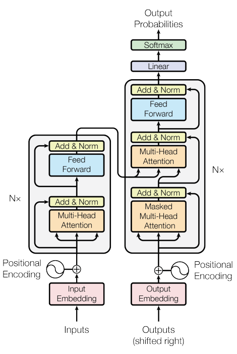

> encoder-decoder

编码器：将输入序列 x 映射为连续表示的序列 z

- 输入序列 x ：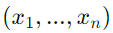
- 映射序列 z ：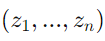

解码器：给定映射序列 z，生成输出序列 y

- 输出序列 y ：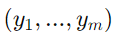
- 在生成下一个符号时，将之前生成的符号作为额外输入

### 【3.1】Encoder and Decoder Stacks

#### Encoder

6个编码层堆叠，每个编码层有2个子层

1个编码层 = 1个多头注意力机制 + 1个逐点全连接前馈网络

每个子层有1次残差连接，并归一化

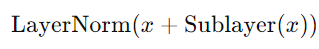

所有子层和嵌入层的输出维度 **d_model** = 512

#### Decoder

6个解码层堆叠，每个解码层有3个子层

1个编码层 = 1个**带掩码**的多头注意力机制 + 1个多头注意力机制 + 1个逐点全连接前馈网络

每个子层有1次残差连接，并归一化

带掩码 ==> 屏蔽作用，防止位置关注到后续位置

### 【3.2】Attention

#### Scaled Dot-Product Attention（缩放点积注意力）

注意力计算公式：

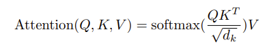

- Q：查询向量
- K：键向量
- V：值向量

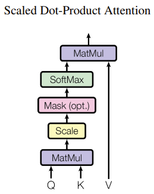

> 最常用的注意力函数

1：additive attention（加法），通过**1个隐藏层的前馈网络**，计算兼容性函数

2：dot-product attention（点积），存在**缩放因子**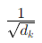

当 **d_k** 值较大时，点积结果会大幅增加，使 softmax 函数趋向极端梯度分布

#### Multi-Head Attention（多头注意力）

多头 ==> 在不同位置、不同表示子空间中，联合关注信息

多头的计算公式：

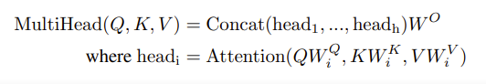

投影矩阵为参数矩阵：

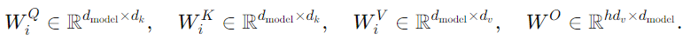

头的数量 **h** = 8

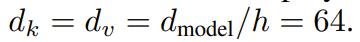

每个头的维度减少，总计算成本与全维度的单头注意力相似

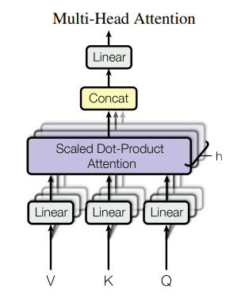

#### Applications of Attention in our Model

1：在编码器-解码器注意力层中，**Q**来自**前一个解码器层**，**K和V**来自**编码器的输出**

2：编码器包含自注意力层。编码器中每个位置，可关注编码器中前一层的**所有位置**

3：解码器中的自注意力层。解码器中每个位置，可关注解码器中**到当前位置的所有位置**（**Masked**）

### 【3.3】Position-wise Feed-Forward Networks（逐点前馈网络）

FFN的计算公式：

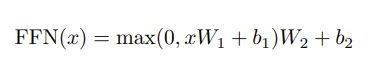

2个线性变换，中间使用ReLU激活

- 第1个线性变换：x·W1 + b1
- 中间的激活函数：max(0, x·W1 + b1) 
- 第2个线性变换：max(0, x·W1 + b1) W2 + b2

另一种描述方法：两个卷积操作，卷积核大小为1

维度结果：

- 输入和输出的维度：d_model = 512
- 中间层的维度：d_ff = 2048

### 【3.4】Embeddings and Softmax

在2个嵌入层和 Softmax 之前的线性变换之间，共享相同的权重矩阵

在嵌入层中，权重乘以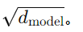

### 【3.5】Positional Encoding（位置编码）

位置编码的维度为：d_model，可以和嵌入层相加

位置编码可学习 或 固定

使用不同频率的正弦和余弦函数：

- pos：位置
- i：维度

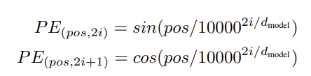

- 位置编码的每个维度，对应一个正弦波
- 波长范围：2π ~ 10000*2π

正弦波的原因 ==> 使模型能推广到比训练中遇到的序列长度更长的情况

## 【4】Why Self-Attention

自注意力的3个动机：

- 每层的总计算复杂度
- 并行计算量，用所需的最少顺序操作数衡量
- 网络中长距离依赖的路径长度

依赖的影响因素：信号在网络中前后传播所需路径的长度。输入和输出序列中任意位置之间的路径越短，学习长距离依赖越容易。

计算复杂度：

- 当序列长度 n 小于表示维度 d 时，自注意力层比循环层更快
- 自注意力层，以固定数量的顺序，执行操作连接所有位置
- 循环层，以O(n)顺序

## 【5】Training

### 【5.1】Training Data and Batching

句对按近似序列长度分组

每个训练批包含一组句对，其中包含约 25000 个源词组和 25000 个目标词组

### 【5.2】Hardware and Schedule

8卡P100

base model：100, 000 step

big model：300, 000 step

### 【5.3】Optimizer

优化器：Adam

β1 = 0.9

β2 = 0.98

ϵ = 1e-9

学习率变化公式：

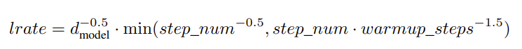

- 热身：线性增加（4000 step）
- 后期：平方反比例降低

### 【5.4】Regularization

训练阶段使用的正则：

1：residual dropout（P_drop = 0.1）

2：label smoothing（ϵ_ls = 0.1）

