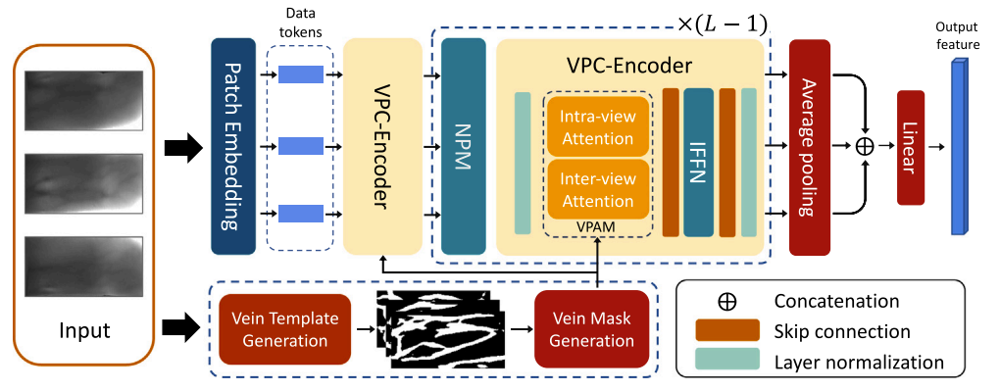

# VPCFormer

A transformer-based multi-view finger vein recognition model
and a new benchmark

## 摘要

VPCFormer：Vein Pattern Constrained Transformer

> VPC的组成

Vein Pattern Constrained Encoders（VPC-Encoders）

Neighborhood-Perspective Modules（NPMs）

> VPC的equip

Vein Pattern Attention Module（VPAM）

Integrative Feed-Forward Network（IFFN）

## 数据集

> 预处理步骤

1：粗糙的边界检测

2：精细化边界

3：角度对齐

4：region of interest生成

## 方法

> 框架图

（融合过程中）多数投票法：当一个像素被三种或更多算法标记为静脉点时，它在融合的静脉模板中被标记为静脉点；否则，它被标记为背景点。

(1) **Vein Pattern Constrained Encoder (VPC-Encoder)**：

- 包含两个主要组件：

  - Vein Pattern Attention Module (VPAM)

    ：

    - 使用静脉掩码专注于指静脉模式，避免背景噪声干扰。
    - 提取视角内（intra-view）和视角间（inter-view）静脉相关性。

    

  - Integrative Feed-Forward Network (IFFN)

    ：

    - 集成点卷积和深度卷积，增强特征聚合能力。
    - 与传统FFN相比更适应图像数据，提升模型性能。

    

(2) **Neighborhood-Perspective Module (NPM)**：

- 通过局部卷积操作捕获单视角内的像素关联，补偿静脉掩码引入的局限性。
- 使用两层3×3卷积模拟5×5的局部关系，提高非线性表示能力。

(3) **全局结构**：

- 输入多视角指静脉图像，经过嵌入层分割为patch并编码为tokens。
- 每个视角分别通过多个VPC-Encoder和NPM模块提取特征。
- 最后，通过**线性层融合**所有视角的特征，生成最终的多视角静脉特征用于识别。f=Linear(Concat(f1,...,fU)).

