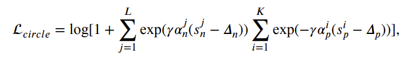
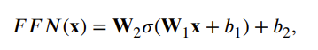
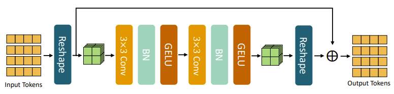

# 基于亮度先验与区域约束的指静脉识别算法研究

104page

## 0：摘要

### 指静脉识别技术的问题

1：纹路稀疏、对比度低、局部模糊

2：二维平面丢失空间信息

### 研究内容

1：图像亮度分布描述子 + 亮度先验的特征提取算法

2：区域约束的分层内容感知网络（CNN + LSTM）

3：自注意力

## 1：绪论

### 指静脉特征提取的方法

### 数据集

【单视角】

ROI: region of interest

【多视角】

### 评价标准

【1：静脉识别】

一对多过程：将待识别人的指静脉特征，与数据库中已经注册的所有指静脉特征模板进行比对，并返回其对应的身份标签

> 准确率——Accuracy

$$
Accuracy  = \frac{n_{accurate}}{n_{total}}
$$

【2：静脉验证】

一对一过程：将待识别人的指静脉特征，与其所声明的身份进行比对，并返回“是”或“否”的验证结果

真实匹配 && 虚假匹配——通过相似性匹配的阈值设定

> 错误接受率——FAR

$$
FAR=\frac{FP}{FP+TN}
$$

> 错误拒绝率——FRR

$$
FRR=\frac{FN}{TP+FN}
$$

> 混淆矩阵

FP+TN：类间匹配次数

TP+TN：类内匹配次数

> 检测错误权衡曲线——DET
>
> 受试者工作特征曲线——ROC

### 存在问题

1：有效静脉信息不足

2：单视角导致空间 歧义

### 研究思路

1：利用与静脉无关的先验信息 + 提取含有有效静脉信息区域的局部特征

2：多视角 + 推断视角相关性与隐式空间信息

## 2：结合亮度先验信息的单视角指静脉识别算法

### 知识背景

1：二值特征学习

语义相似性保持的离散二值特征学习

2：方向差分向量DDV

### 亮度先验信息——亮度分布向量IDV

### 方向特征DDV提取

Gabor 滤波器

### 获取图像亮度分布图的方法

高斯模糊（失真小、运行速度快）

### IDV和DDV特征讨论

IDV：提取非静脉纹路的亮度分布

DDV：提取静脉纹路的方向

同源不同类的特征

### 语义相似性保持的离散二值特征学习算法

SSP-DBFL：离散二值特征学习算法

在公共hamming space，捕捉亮度特征和空间特征的一致性，联合学习

优化SSP-DBFL：

## 3：基于显著性区域约束的多视角指静脉识别算法

显著性区域：有较丰富的特征信息的识别区域

CNN-LSTM架构：提取视角相关性，定位显著性区域，约束特征提取范围

### RNN、LSTM

GRU：门控循环单元

GRU单元的结构

双向GRU网络：避免了输入序列顺序的影响

### 基于视角的物体识别

MVCNN：多视角CNN

Multi-view deep network：多视角深度网络

RotationNet：旋转网络

view-GCN：图卷积网络

### 空间变换网络STN

spatial transformer network

即插即用，学习如何在空间上变换输入数据（图像的平移、旋转、缩放）

> STN的组成
>
> 1：定位网络（预测变换参数Θ）
>
> 2：网格生成器（根据Θ，建立针对输入数据的采样网格）
>
> 3：采样器（根据网格生成器，抽取输入数据的特征值，根据特征值建立变换后的输出）

### HCAN：分层内容感知网络

hierarchical content-aware network

从多视角图像中，提取全局特征和局部特征

> 框架图
>
> 上方是GSN
>
> 下方是LPM

全局骨干网络：GSN

局部感知模块：LPM

双向卷积门控循环单元：ConvBiGRU（从有序的多视角图像序列中提取含有视角间相关性的全局多视角特征）

> GSN（全局）

1：利用非线性函数（inception block），提取每个视角图像的特征图

【非线性函数网络F的结构】

【IB的流程图】

2：将每个视角的特征图，按照视角顺序构造成有序序列，送入ConvBiGRU中，获得视角间的依赖关系和全局多视角特征

【重置门r】

上一个隐状态h，有多少信息，能与当前输入m，融合

【更新门u】

上一个隐状态h，有多少信息，能直接被保留

【全局特征】

最后一个隐状态

【记忆加权策略】

根据隐状态之间的相似性，处理之前的隐状态，使得最终的输出能回忆被遗忘的某些细节特征

hi和hj之间的记忆相似性：

其中，Hf为特征图高度，Wf为特征图宽度

> LPM（局部）

局部感知模块的功能：区分 + 定位 + 裁剪 显著区域

定位方法：STN

图像熵：指导局部感知模块直接对显著性区域进行感知和定位

> 整体损失函数

全局骨干网络的损失函数：circle loss

局部感知模块的损失函数：图像熵损失 + circle loss

HCAN的整体损失函数：

其中，λ均为平衡系数

### 多视角数据集构建

3个视角

THUMVFV-3V（Tsinghua Multi-View Finger Vein - 3 Views）

> 采集方式：双阶段

两个阶段，间隔30+天

双手的食指和中指，每根手指每个阶段采集6个视角（0、+45、-45，均采集2次）

> 预处理方法

1：直方图均衡，获得粗糙的掩膜

2：精细化掩膜

3：边界平滑

4：角度矫正

5：尺寸归一化

### 实验分析与讨论

数据库：THUMVFV-3V、MFDV（背侧静脉）

[sigs.tsinghua.edu.cn/labs/vipl/thu-fvfdt.html](https://www.sigs.tsinghua.edu.cn/labs/vipl/thu-fvfdt.html)

> HCAN双阶段训练

第一阶段，训练CNN

第二阶段，训练ConvBiGRU

余弦相似度——衡量两个多视角特征向量的匹配得分

（Sim越小，越相似）

> 数据增强

单视角：平移、对比度变化、高斯模糊

多视角：和单视角相同，但需要保证一个多视角样本内的不同视角的增强参数相同

> 消融实验

需要消融的模块：

1：双阶段训练

2：记忆加权

3：局部感知模块

4：图像熵损失

> 单视角的识别工作

评价指标：accuracy

> 多视角的识别工作

评价指标：accuracy，与0°视角的对比

单视角算法的扩展：特征融合、得分融合、结果融合

> 多视角的验证工作

评价指标：EER

> 视角一致性的有效性

当破坏视角一致性时，可以通过对不同次采集的视角图像进行重组的方式进行**数据增强**

符合视角一致性的多视角样本：

不符合视角一致性的多视角样本：                                                                                                                                    

L表示-45°，M表示0°，R表示+45°

## 4：基于静脉纹路区域约束的多视角指静脉识别算法

### 静脉模板生成

静脉模板：标记静脉纹路分布的二值化图像

静脉点：灰度值 = 255

背景点：灰度值 = 0

### transformer

> encoder - decoder结构

输入嵌入层：word2vec，词向量

位置编码：捕捉输入序列中的空间位置关系

编码器：自注意力机制、多头自注意力、前馈网络、相加与归一化

> self-attention

> 前馈网络FFN

2个线性层 + 1个非线性激活函数

W1和W2：线性层

b1和b2：偏置

σ：非线性激活函数

> 相加与归一化

1：跳层连接（skip）

2：层归一化（Layer Normalization）

> ViT

1：输入的图像，被切分成N个固定大小且不重叠的patch

2：将patch展平成一维向量，通过patch embedding layer中的一个线性变换层，映射到嵌入空间，得到维度为d的**嵌入向量x（数据token）**

3：拼接类别token到数据token序列的头部，输入序列为X0

4：X0经过L个transformer编码器，输出为Xl

> ViT 通过数据 token 和类别 token，实现了对图像的局部和全局特征的提取

### 总体结构：VPCFormer

vein pattern constrained transformer

VPC-Encoder：静脉纹路约束的编码器（视角内 + 视角间）

NPM：邻域感知模块（提取每个视角局部邻域内的相关性）

> 静脉模板与静脉掩膜生成

静脉模板生成：

当一个像素点被 3 个或 3 个以上的算法标记为静脉点时，才会将融合的静脉模板的对应位置标记为静脉点

静脉掩膜生成：

阈值的大小决定了静脉掩膜中每个位置的输出，对静脉模板中对应区域内含有静脉点数量的敏感程度

> VPC-Encoder

组成部分：

1：VPAM，静脉纹路注意力模块

2：IFFN，聚合前向推理网络

VPAM的结构：

VPAM的步骤：

1：视角内静脉纹路相关性的提取

2：视角间静脉纹路相关性的提取

3：两种相关性进行融合输出

IFFN的结构：

利用1×1 卷积核的逐点卷积（pointwise）和 3×3 的深度卷积，替换了原始 FFN 中的两个线性层

> 邻域感知模块：NPM

NPM的结构：

采用2层 3×3 卷积核

> 块嵌入层

1层 p×p 卷积层，获取patch的向量表示

步长为p，输出通道为d

> 输入层

经过 L−1 个 NPM 与 L 个 VPC-Encoder后，可得到所有视角的数据token序列

直接对每个视角的数据token，进行平均池化

> 损失函数

circle loss

### VPCFormer和HCAN的讨论

> 相同

采用全局特征 + 局部特征

> 不同

HCAN利用全局骨干网络，直接感知每个视角的所有内容

VPCFormer利用静脉掩膜，感知不同视角下纹路之间的相关性（避免耦合）

### 实验分析与讨论

> 数据集

第一阶段的数据作为训练集，第二阶段的数据作为测试集

输入图像：224 * 224

> 数据增强方法

1：沿手指长轴平移

2：对比度变换

3：高斯模糊

4：尺寸归一化

> 消融实验

需要消融的模块：

1：NPM

2：VPAM

3：IFFN

4：静脉掩膜

> 超参数实验

需要人为设置的参数：

1：图像尺寸

2：patch尺寸

3：token维度**d**

4：VPC-Encoder的堆叠深度**L**

5：MHSA的头数**h**

6：每个注意力投的维度**d_head**

参考设置：ViT的tiny和small

> 视角token和类别token的有效性

添加2类token，会有负影响

> 位置编码的有效性

1：不适用位置编码策略

2：不同视角图像的位置编码相同

3：不同视角图像的位置编码连续

## 5：总结

### 创新

1：**亮度先验**与**方向信息**联合学习的离散二值特征学习算法

2：基于局部显著性区域约束的多视角指静脉识别算法（HCAN）

3：基于静脉纹路区域约束的多视角指静脉识别算法（VPCFormer）

### 局限性

1：IDV特征没有和静脉纹路的主特征完全解耦

2：HCAN训练速度慢，需要在线计算区域图像熵矩阵

3：VPCFormer在patch尺寸减小时，训练推理速度变慢，显存占用变大

### 未来方向

1：跨设备数据下的识别

2：采集设备小型化

3：多视角指静脉的三维重建（点云结构）

