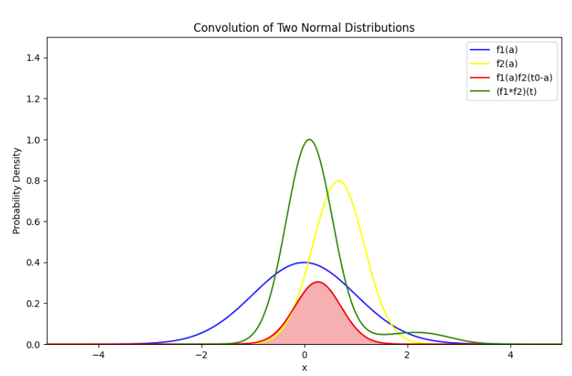
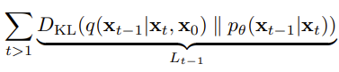

# DDPM（Diffusion）

denoising diffusion probabilistic models

https://blog.csdn.net/qq_45752541/article/details/127956235

https://blog.csdn.net/weixin_45897172/article/details/143098151

https://blog.csdn.net/weixin_45897172/article/details/143194788

## 摘要

高质量图像合成

a novel connection between diffusion probabilistic models （扩散概率模型） and denoising score （去噪分数） matching with Langevin dynamics （朗之万动力学）

渐进的有损解压方案 a progressive lossy decompression scheme ==> 自回归解码的推广（autoregressive decoding）

## 【1】引言

生成式模型：GANs、autoregressive模型、flow模型、VAEs

扩散模型是参数化的马尔科夫链，通过变分推断进行训练，在有限时间内生成与数据匹配的样本

我们模型中的无损编码长度，大部分都被用于描述难以察觉的图像细节

扩散模型的采样过程是一种渐进式解码，类似于自回归解码的比特排序，极大地拓宽了自回归模型的通常可能性

> X0到XT：前向过程，加噪
>
> XT到X0：逆向过程，减噪

## 【2】背景

> 正态分布 Normal Distribution

数学公式：

扩散模型是隐变量模型：

x1,…,xT 是与数据 x0∼q(x0) 具有相同维度的隐变量

> reverse process

联合分布

起始：

马尔可夫过程：

> forward/diffusion process

根据方差调度 β1,…,βT，逐步向数据添加高斯噪声

马尔可夫过程：

训练 ==> 优化负对数似然的常规变分界限

前向过程的方差βT，由重参数化方法学习（reparameterization），或作为超参数保持常数

反向过程的表现力，部分通过选择高斯条件来保证

前向过程允许在任意时间步 t，以封闭形式进行采样：

训练 ==> 用随机梯度下降法优化 L 的随机项

利用 KL 散度，将与前向过程的后验分布进行比较，重写 L：

> KL 散度是一种不对称统计距离度量，用于衡量一个概率分布 P 与另外一个概率分布 Q 的差异程度。

前向过程的后验分布（forward process posteriors）在条件 x_0 下是可处理：

> 其他内容

对两个概率分布进行卷积操作，实质上是计算这两个分布的所有可能的组合情况，并得到这些组合情况得到概率分布，即：叠加后的概率分布

- 蓝色曲线：正态分布1的概率密度
- 黄色曲线：正态分布2对称翻转后的概率密度
- 红色曲线：两个分布在当前位置的概率密度的乘积
- 绿色曲线：两个分布叠加后的概率密度

两个正态分布的卷积，是一个新的正态分布：

## 【3】扩散模型和去噪自动编码器

### 3.1 forward process L_T

(1) βT，固定为常数

(2) 近似后验q，没有可学习的参数

==>L_T 在训练中是一个常数 

> 前向过程定义的内容

1：后一时刻与前一时刻的关系

2：从原图X0到加噪后任意时间步图像Xt的关系

### 3.2 reverse process and L_1:T-1

可以看做拉近 2 个分布的距离

第一个分布：高斯分布

第一个分布的均值和方差：

第二个分布：网络期望拟合的目标分布，也是高斯分布

上述两个分布的方差均是常数，和优化无关

优化目标 ==> Min两个分布均值的二范数

训练反向过程的均值函数近似器 μθ来预测

### 3.3 data scaling, reverse process decoder, and L_0

将反向过程的最后一项设定为一个基于高斯分布的独立离散解码器

- D 是数据的维度
- 上标 i 表示提取某一维度的数据

### 训练 & 测试伪代码

训练过程：

- for ... in range(iterations)
- 从数据集里面取出一个x0
- 从均匀分布(1, T)里面取一个数
- 从标准高斯分布，采样1个噪声ϵ
- 梯度下降，最小化二范数损失
- 训练到收敛

采样过程：

- 从标准高斯分布，采样1个噪声xT
- 从时间步T正向扩散到时间步1
- 如果时间步大于1，则从标准高斯分布，采样1个噪声z；否则z = 0
- 根据高斯分布，计算每个时间步t的噪声图

