# 指静脉论文阅读

## 1：CRCGAN: Toward robust feature extraction in finger vein recognition

**摘要：**

深度卷积神经网络（CNN）在指静脉识别中取得了显著成果，但其往往容易过拟合标签信息，导致关键图像特征的丢失，并对噪声高度敏感，输入的微小变化可能会导致错误的识别。为了解决这些问题，本文提出了一种新型的分类重建循环生成对抗网络（CRCGAN）。该网络包括特征生成器、特征判别器、图像生成器和图像判别器，旨在实现鲁棒的特征提取。具体而言，特征生成器用于提取分类所需的特征，图像生成器从这些特征重建图像。两个判别器提供反馈，指导生成器提高生成数据的质量。通过双向图像到特征的映射以及循环对抗训练，CRCGAN实现了关键特征的提取并最小化了过拟合。此外，正是由于关键特征的提取，CRCGAN对噪声不敏感。在包括THU-FVFDT2、HKPU和USM的三个公开数据库上的实验结果表明，CRCGAN表现出竞争力的性能和强大的抗噪性，分别在三个数据库上实现了98.36%、99.17%和99.49%的识别准确率，并且在HKPU和USM数据库的噪声条件下准确率下降幅度不足0.5%。

**方法：**

框架图：

领域迁移：

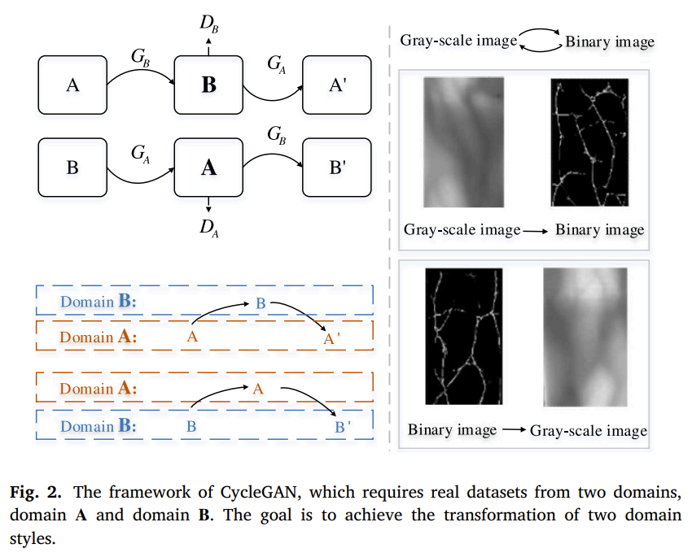

## 2：Disentangled Representation and Enhancement Network for Vein Recognition

**摘要：**

近年来，静脉识别在生物识别领域备受关注。然而，在静脉图像的采集过程中，由于光照变化等外部因素的影响，相同身份的静脉图像可能在纹理信息上有所变化，这增加了类内差异并显著降低了静脉识别系统的性能。为了解决这一问题，本文提出了一种用于静脉识别的解耦表示与增强网络（DRE-Net）。首先，通过设计的静脉分割算法获取鲁棒的静脉形状掩码，这些掩码被用作DRE-Net中形状特征的标签信息。其次，设计了一种解耦表示网络，其中包含两个编码器和两个解码器，用于分离静脉图像的纹理特征和形状特征。此外，还提出了一种多尺度注意残差块（MSARB），以更好地挖掘静脉网络信息，并增强DRE-Net对静脉图像的表示能力。最后，提出了一种基于权重引导的特征增强模块（WGFEM），通过降低纹理特征的重要性并增加形状特征的重要性，从而获得更具区分性的表示，减少由光照变化引起的类内差异。在三个基准静脉数据库上的广泛实验表明，本文提出的模型优于现有的最新方法。

**方法：**

DRE-Net框架

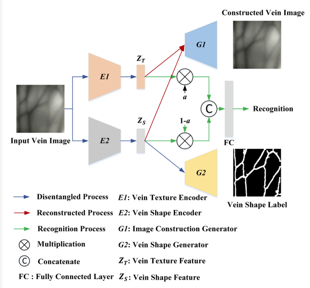

对于**shape特征和texture特征**的细节框架

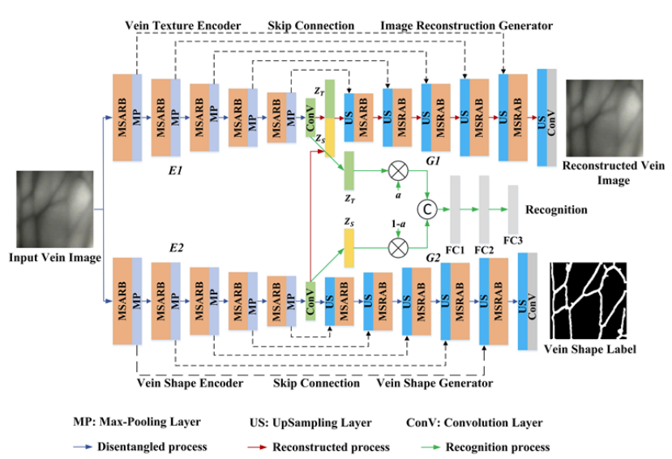

UNet的下采样部分被替换为MSARB，具体结构如下

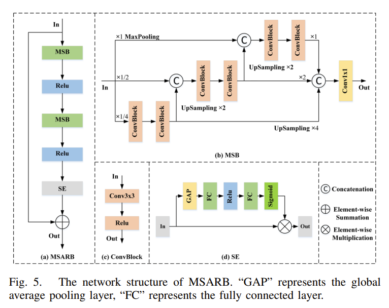

## 3：FVFSNet: Frequency-Spatial Coupling Network for Finger Vein Authentication

**摘要：**

指静脉生物识别因其活体检测、高安全性和用户便利性而成为人类认证的重要途径。尽管现有的基于深度学习的方法在指静脉认证中取得了显著进展，这些方法主要在空间域中提取指静脉图像的特征，可能忽略了其他域（如频率域）中存在的重要信息。受此启发以及频率域中图像特征提取卓越性能的驱动，本文探索了一种能够同时在空间域和频率域中提取指静脉特征的方法，使来自不同域的特征可以相互补充。此外，本文提出了一种新颖的频率-空间耦合网络（FVFSNet）用于指静脉认证。FVFSNet主要由三个部分组成：(1)频率域处理模块（FDPM），(2)空间域处理模块（SDPM），以及(3)频率-空间耦合模块（FSCM）。FDPM用于提取频率域中的指静脉特征，主要包括频率-空间域转换和频率域卷积层；SDPM用于提取空间域中的指静脉特征，主要由高效设计的卷积层组成；FSCM用于耦合从FDPM和SDPM提取的特征，主要由通道和空间注意力机制组成。通过在九个常用公开指静脉数据集上进行的大量实验验证了FVFSNet的性能。实验结果表明，频率域神经网络在指静脉认证中具有显著效果，所提出的FVFSNet以轻量化和低计算成本的优势实现了最先进的性能。

**频率域：**

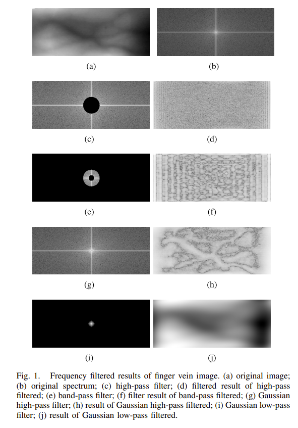

**方法：**

FVFSNet的框架

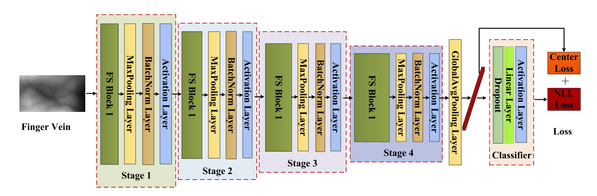

FS Block的细节

FS Block = Frequency domain processing（频率域处理） + Spatial processing（空间域处理） + Frequency-spatial coupling（频率-空间耦合）

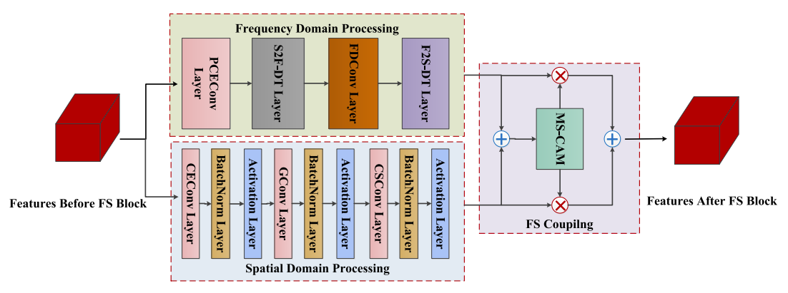

各个特殊Conv模块的架构

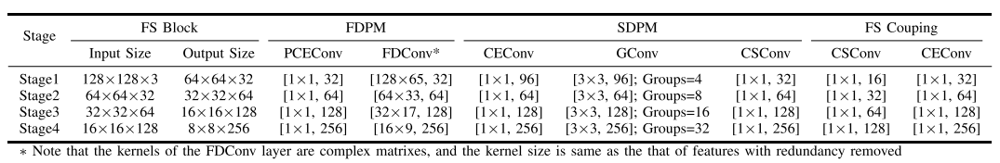

MS-CAM的架构

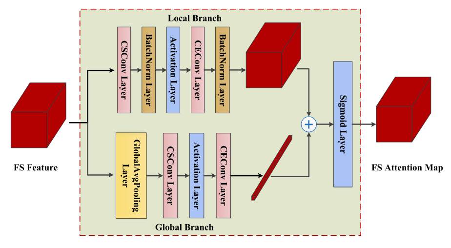

## 4：Small-Area Finger Vein Recognition

**摘要：**

近年来，指静脉传感器已被嵌入到各种电子设备中用于个人身份识别，例如智能门锁和考勤机。这些嵌入式传感器通常较小，因此只能捕捉部分指静脉。然而，现有研究主要集中于近全指静脉识别，而忽视了因指静脉传感器的小型成像窗口所导致的部分指静脉图像问题。本文旨在研究基于部分指静脉图像的个人身份识别，称为小面积指静脉识别。首先，通过从近全指静脉图像中剪裁局部区域来模拟小面积指静脉图像，并分析其对识别性能的影响。其次，使用商用指静脉成像设备构建了一个小面积指静脉数据库，其中捕捉了约占成年人单指三分之一的静脉模式。为从小面积指静脉图像中提取更多区分信息，本文提出了一种基于局部约束一致字典学习（LCDL）的方法，以融合多种特征用于小面积指静脉识别。最后，所提方法在自建小面积指静脉数据库以及四个合成小面积指静脉数据库上进行了评估。实验结果表明，所提方法在小面积指静脉识别中具有良好的性能。

**方法：**

LCDL：locality-constrained consistent dictionary learning

## 5：The neglected background cues can facilitate finger vein recognition

**摘要：**

近年来，基于指静脉的生物认证因其高效性和高安全性引起了广泛关注。然而，大多数现有的指静脉表示方法专注于静脉特征，而忽略了背景信息，尽管背景信息也包含每个人独特的身份特征。在本文中，我们利用指静脉图像中的背景强度变化作为新特征，丰富了区分性表示，并提出了一种新的描述符，称为**强度方向向量（Intensity Orientation Vector, IOV）**。IOV可以扩展以反映手指组织的特性，为指静脉表示提供更多的信息线索。

此外，我们提出了一种新的学习方案，称为**语义相似性保留的离散二值特征学习（SSP-DBFL）**，用于指静脉识别。与大多数现有的双模态二值特征表示方法不同，SSP-DBFL在通用的汉明空间中保留高层次语义相似性，利用静脉特征和背景信息之间的共识。具体而言，给定一张指静脉图像，我们首先提取方向差向量（DDV）作为主要的静脉特征，并提取IOV作为辅助背景特征。随后，我们在监督的方式下共同学习这些特征的投影函数，将它们转化为具有语义相似性的区分性二值编码。最后，这些二值编码被整合为基于直方图的向量，用于指静脉表示。

在五个广泛使用的指静脉数据库上进行了广泛的实验，结果清楚地表明，我们提出的描述符（IOV）和方法（SSP-DBFL）是有效的。

**方法：**

IOV构造过程：

1：对指静脉图像 I 进行高斯平滑处理，得到平滑后的图像

2：将图像在 M 个方向上的卷积响应除以中心像素的强度值进行归一化，并将所有方向的响应连接起来

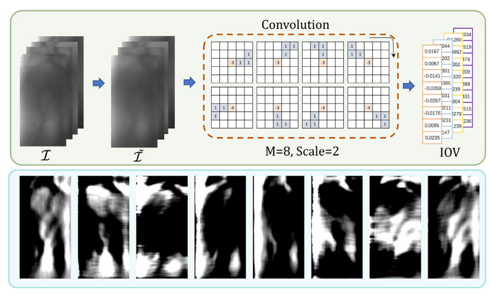

DDV构造过程：

1：方向滤波

2：差异计算

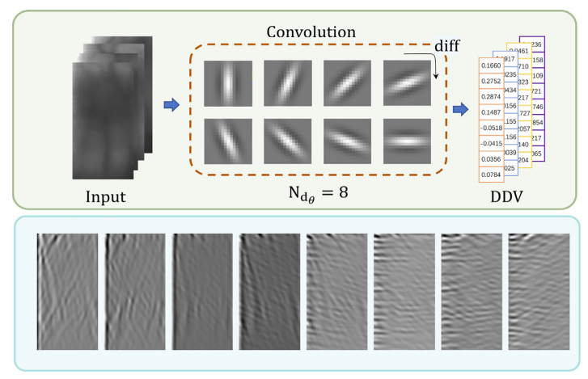

SSP-DBFL：

**特征提取：**
首先，从训练样本中提取静脉特征的方向差向量（DDV）和背景线索的强度方向向量（IOV）。

**联合投影学习：**
接着，联合学习投影函数，将这两种特征转换为紧凑且区分性强的二值编码。

**测试图像编码：**
对于测试指静脉图像，提取DDV和IOV，并将它们联合编码为二值码。

**构建直方图表示：**
最后，利用这些二值码构建基于直方图的向量，用于指静脉的表示和识别。

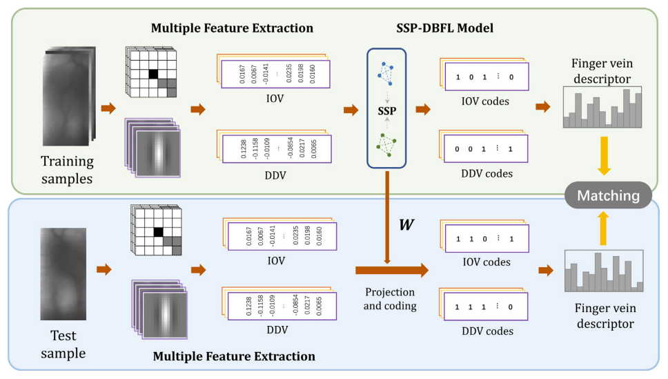